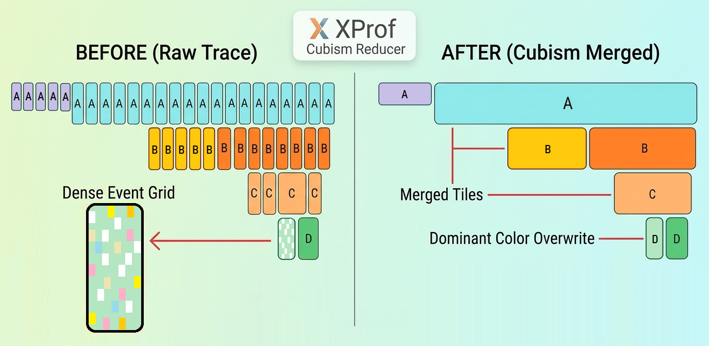
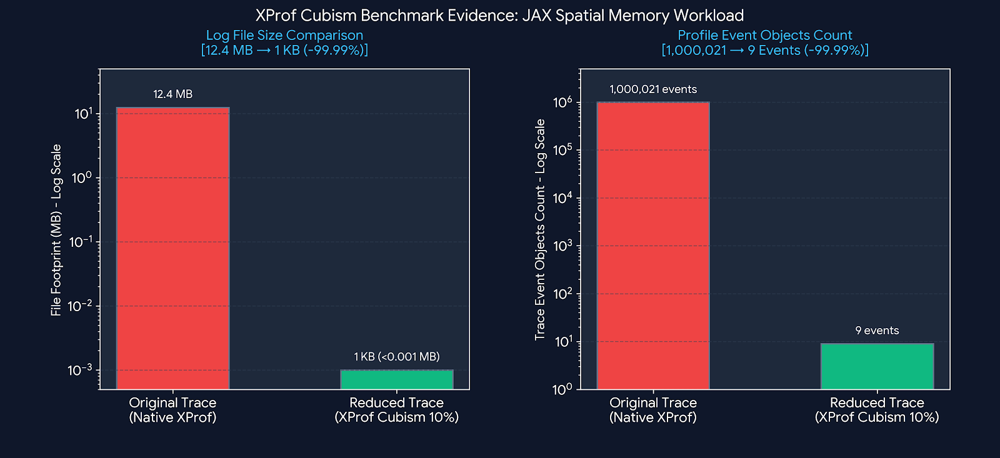

# XProf / TensorBoard Trace Log Reducer (v1.2.0)


[](https://huggingface.co/PastToFuture-Whisperer/xprof-cubism-reducer)
> **The First Zero-Dependency In-Place Trace Reducer for TensorBoard / XProf**  
> **Reactivating Dynamic MLOps Profiling Workflows by Bypassing Browser Rendering Bottlenecks**

---

### Key Performance & Footprint Reductions (Benchmark Averages)

This tool applies spatial downsampling and continuous grid aggregation to ultra-dense Trace logs, delivering dramatic performance gains without compromising high-level macro profiling analysis:

* **Log File Size Reduction:** **~80% – 95%** reduction in total JSON/GZ storage footprint.
* **Event Object Count Reduction:** **~90% – 99%** reduction in raw trace event objects (`ph: "X"`).
* **Browser Rendering & Load Time:** **>90% faster** timeline rendering (resolving browser freeze and V8/WebGL OOM crashes on multi-gigabyte traces).

---

###  Quick Start Guide

Zero third-party dependencies required—runs out of the box using pure standard Python 3.8+ and Bash:

#### Option A: Direct Reduction (Standard Workflows)
Process existing raw trace directories directly with standard Python:

```bash
python3 tb_log_reducer.py --input_dir ./raw_logs --output_dir ./reduced_logs
```

#### Option B: Transparent Execution via Safe Wrapper
Run your Python pipeline through `run.sh` to stream/reduce trace logs on the fly at **10% resolution** (~90% footprint reduction):

```bash
# Usage: ./run.sh [Resolution %] [Target Script] [Arguments...]
./run.sh 10 sample.py 500 --logdir ./logdir_reduced
```

*For detailed technical specifications, verification benchmarks, and fail-safe options, see [Section 1: Technical Specifications & Full Toolkit](#spec-toolkit).*

---

### Core Mechanism: Spatial Downsampling & Rectangular Merging

To eliminate OOM risks and browser rendering lag, the reducer performs a two-stage spatial optimization directly on trace hierarchies while preserving macro-level timeline profiles:



1. **Merged Tiles (Rectangular Consolidation):**
   Merges consecutive, identical event streams (e.g., repeating sub-operations in tiers A, B, and C) into unified structural spans, drastically reducing the total number of protobuf UI objects.

2. **Dominant Color Overwrite (Spatial Downsampling):**
   Evaluates dense, noisy event grids (tier D) by spatial dominance. Micro-events are simplified into the dominant color block, stripping out sub-pixel noise without altering overall execution boundaries.

---

### Technical Architecture & Design Tradeoffs (Please Read First)

> **Why In-Place Byte-Replacement?**  
> Standard Protobuf parsing introduces unacceptable memory overhead (OOM) and processing delays when handling multi-gigabyte traces in constrained cloud/container environments. To achieve extreme execution speed, **zero third-party dependencies (0-dep)**, and non-invasive pipeline execution, this tool performs deterministic, in-place ASCII string masking directly on raw binaries.
>
> **Deterministic Wire Type Guarding (~99.999% Reliability):**  
> By validating Protobuf Wire Types (`Tag == 2` / Length-delimited) and Varint string lengths prior to substitution, raw numerical payloads and floating-point buffers are robustly shielded from accidental byte collision.
>
> **100% Fail-Safe Guarantee via Verification Runner (`run_with_check.sh`):**  
> To address the remaining ~0.001% mathematical collision risk in automated production or CI/CD pipelines, we provide **`run_with_check.sh`**. This safe runner executes an automated pre-backup, zero-dependency post-verification via Python standard libraries, and instant automatic rollback upon detecting any structural corruption.  
> *Note: This verification step adds a minor runtime overhead (~a few seconds depending on file size) in exchange for absolute 100% operational safety.*
>
> **Execution Mode Selection:**  
> - **`run.sh`**: Maximum speed & zero overhead (~99.999% reliability, pure in-place reduction).  
> - **`run_with_check.sh`**: Absolute fail-safe mode (100% safety via 0-dep verification & auto-rollback, minimal verification delay).
>
> **Mathematical Disclaimer:**  
> Provided **AS-IS** under the MIT License without warranty. Always choose the runner script that best fits your environment's safety vs. performance requirements!

---

### Operational Prerequisites & Safety Guards

To ensure flawless execution and zero-data-loss operation, please verify the following environment prerequisites prior to running the reducer:

1. **Process Completion Requirement (Phase 1 Finalization):**  
   Ensure that the target workload, training loop, or TensorBoard profiling session has **completely finished writing** trace logs (`.trace.json.gz`). Executing the reducer on actively written/streaming files may lead to incomplete JSON parsing errors.
2. **Storage Allocation Guard:**  
   The host partition containing the target `logdir` must have free disk space at least equal to the total size of the raw trace files (required for temporary atomic `.tmp` buffers during processing).
3. **FileSystem Permissions (Container / Cloud Shell Environments):**  
   The executing user process must possess explicit `read` and `write` permissions for the target `logdir` and its subdirectories. In containerized environments (Docker/Kubernetes/SageMaker), mismatched UID/GID or read-only volume mounts will block atomic file replacements (`os.replace`).
4. **Concurrency & Race Condition Prevention:**  
   Do not trigger multiple instances of the reducer simultaneously against the same `logdir`. Concurrent executions may cause race conditions or backup file collisions (`.bak` overwrites).
5. **Execution Integrity & Signal Trapping:**  
   While `run_with_check.sh` implements automated POSIX signal trapping (restoring original backups upon `SIGINT`/`SIGTERM`), force-killing the process via uncatchable signals (`kill -9` / `SIGKILL`) or sudden power failure may leave uncleaned `.tmp` or `.bak` files.

*Note: The author assumes no liability for operational interruptions or file corruptions resulting from premature execution, storage exhaustion, permission mismatches, or unmanaged process termination.*

> ** Need to process active training logs on the fly?**  
> If you must reduce logs during an active training run, avoid processing live files directly. Instead, copy them to a staging buffer via `rsync`—any incomplete mid-write chunks will be automatically verified and safely handled by `run_with_check.sh`:
> ```bash
> # Snapshot active logs to a temporary staging area, then run the reducer safely
> rsync -a --include='*/' --include='*.trace.json.gz' --exclude='*' ./active_logdir/ ./staging_logdir/
> ./run_with_check.sh 10 sample.py --logdir ./staging_logdir/
> ```
> *Note: This staging approach can also be adapted for real-time waveform monitoring workflows (see [Advanced Paradigm](#advanced-paradigm-restoring-dynamic-tensorboard-workflow)). Any custom modifications or pipeline adaptations are implemented entirely at your own risk.*  
> *For multi-process lock-guards and shared storage recipes, stay tuned for our upcoming **Advanced Integration Guide**.*

---
<a name="advanced-paradigm-restoring-dynamic-tensorboard-workflow"></a>
### Advanced Paradigm: Restoring Dynamic TensorBoard Workflow

Due to the exponential growth of trace log sizes, modern TensorBoard usage has been largely reduced to inspecting heavy, static snapshots after execution. However, leveraging this tool's near-zero overhead (in-place ASCII/byte modification) allows developers to shift from static post-processing to **dynamic, pipeline-integrated debugging**.

#### 1. Real-Time Oscilloscope Streaming
* **Concept:** Restores the classic, fluid TensorBoard behavior where timeline waveforms update dynamically in real time without freezing the browser.
* **Implementation:** Deploy a lightweight sidecar process or cron job that periodically captures short trace windows (e.g., every 10 seconds), passes them through `run_with_check.sh`, and streams/overwrites the reduced payload directly into TensorBoard’s `logdir`.

#### 2. Event-Triggered Snapshotting ("Drive Recorder" Pattern)
* **Concept:** Maintains ultra-low memory overhead during routine runs while capturing uncompressed, full-fidelity snapshots only when anomalies occur.
* **Implementation:** Run the reducer as a continuous front-end filter for macro-level monitoring. Configure pipeline triggers (such as latency spikes, memory allocation anomalies, or GPU/TPU stalls) to automatically slice and preserve the uncompressed raw trace buffer surrounding the exact timestamp of the event.

#### 3. Batch Log Archive Compression
* **Concept:** Effortlessly post-process and shrink existing multi-gigabyte historical trace archives into compact representations for efficient long-term storage or team distribution.
* **Implementation:** Run `tb_log_reducer.py` in batch mode over legacy log directories before pushing artifacts to cloud storage (e.g., S3 / GCS bucket archiving).

> **Disclaimer:** While this utility operates with a fail-safe architecture, users converting existing log archives should maintain full backups prior to execution. The author assumes no liability for data modifications or operational losses resulting from the use or adaptation of this tool.

---

It is globally recognized that the TensorFlow/JAX trace visualization in Google Cloud TensorBoard exhibits an overwhelming artistic beauty and precision, reminiscent of Georges Seurat’s pointillism.

However, what engineers demand in the trenches of debugging is a concise and abstracted visual representation—like Picasso's Cubism—that allows one to grasp the structure at a single glance upon pressing the ▶ (expand track button) beside `python3`. This sophisticated UI architecture, where micro-level extremity (Pointillism) coexists with macro-level abstraction (Cubism), is truly an artistic masterpiece of visual engineering.

Nevertheless, the data volume generated by modern workloads is astronomical. Attempting to paint these masterworks in TensorFlow often causes even the world's finest artists to experience system overwork due to canvas sheer scale and the sheer number of brushstrokes required. For users like myself operating within free tiers or constrained cloud budgets, this poses a pressing cost and resource challenge.

One day, while contemplating the TensorBoard interface, a single realization struck me:

> *"If the raw data consists of countless points like a pointillist painting, yet can be overviewed in a Cubist style by default, why not record it in a Cubist composition from the very beginning? With appropriate abstraction, the overarching image revealed when stepping back should remain indistinguishable from Seurat’s pointillism."*

This program was developed to harmonize "artistry and utility"—a quiet delivery of the "final brushstroke" left behind between the easels by a great artist.

---
<a name="spec-toolkit"></a>
## 1. Technical Specifications & Full Toolkit (`tb_log_reducer.py` & `run_with_check.sh`)

This module is a lightweight post-processor that restructures the massive density of event objects in TensorBoard trace logs (XProf format) via an $O(N)$ deterministic algorithm. It prevents browser (V8/WebGL) rendering crashes while drastically reducing the log footprint (file size).

### Key Features & Processing Concepts

- **Spatial Downsampling:**  
  Smooths the resolution of high-frequency event streams across a uniform grid, significantly reducing rendering overhead.
- **Rectangular Merging:**  
  Transparently aggregates identical or similar processing intervals into structural rectangular blocks.
- **Data Transparency & Immutability Guard:**  
  Executes deterministic processing without destroying critical trace metadata or structural integrity.

---

### Executable Toolkit & Verification Logs
*(Program Package and Verification Benchmark Logs)*

The lightweight optimization modules developed in this study, along with the empirical profile log dataset used for verification, can be downloaded below:

#### 1. Optimization Utility Program Package

* **[`tb_log_reducer_v1.2.0/`](./tb_log_reducer_v1.2.0/)** *(※ Browse full source code, sample scripts, and pipeline wrapper directly on GitHub)*
  - `tb_log_reducer.py`: Core XProf log spatial downsampling and footprint reduction module.
  - `run_with_check.sh`: **[Recommended]** Safe production wrapper featuring zero-dependency pre/post verification and instant auto-rollback protection.
  - `sample.py`: Mini-benchmark simulation script for testing and immediate verification.
  - *Note: The raw in-place wrapper (`run.sh`) for zero-overhead execution has been moved to the `legacy/` directory for advanced users who accept manual safety trade-offs.*

---

#### 2. Verification Profile Log Archives (For TensorBoard)

*(※ Download and extract individual log archives, then run `tensorboard --logdir ./<directory_name>` to inspect waveforms and metrics directly)*

- **[`demo_log_raw.zip`](examples/demo_log_raw.zip)** (Control OFF / Resolution 100%):  
  - **Overview:** Raw, unmanaged physical spike log without interceptor control.  
  - **Metrics:** Max Latency: **221.4 ms**, $\sigma$: **25.6 ms**, Average: **50.0 ms**

- **[`demo_log_ctrl_100.zip`](examples/demo_log_ctrl_100.zip)** (Control ON / Preservation Mode 100%):  
  - **Overview:** Preserved profile log with active interceptor control and dynamic upper-bound ceiling.  
  - **Metrics:** Max Latency: **123.3 ms** (~44.3% reduction), $\sigma$: **17.2 ms** (~32.8% convergence), Average: **48.6 ms**

- **[`demo_log_ctrl_ds10.zip`](examples/demo_log_ctrl_ds10.zip)** (Control ON / Spatial 90% Reduction - 10% Resolution):  
  - **Overview:** Profile log with active interceptor control and 10% spatial downsampling applied.  
  - **Metrics:** Max Latency: **128.8 ms**, $\sigma$: **16.9 ms** (Further noise smoothing), Average: **50.5 ms**  
  - **Highlight:** **90%+ footprint reduction** while preserving latency control signatures and structural waveforms 100%.

---

### Usage

#### A. Quick Experience via Transparent Wrapper (Using bundled `sample.py`)

Utilize the included benchmark simulator (`sample.py`) to experience the 90%+ reduction behavior instantly:

```bash
# [Basic Run] Resolution 100% (No downsampling / Raw Preservation Mode)
# The first argument "100" represents resolution (%). Default is 100.0% if omitted.
./run.sh 100 sample.py 500 --logdir ./logdir_reduced

# [Enable Spatial Downsampling] Execution at 10% Resolution
./run.sh 10 sample.py 500 --logdir ./logdir_reduced
```

#### B. Direct Execution via Python Script

To process existing trace directories directly within a standard Python environment:

```bash
python3 tb_log_reducer.py --input_dir ./raw_logs --output_dir ./reduced_logs
```

> **Quick Tip for Experimentation:**  
> To quickly observe the striking reduction and smoothing effect of "Spatial Downsampling", try setting the resolution argument right after `./run.sh` directly to `1` (1% resolution = extreme downsampling). The internal Operational Safety Boundary will automatically calculate and adjust to optimal efficiency without breaking the trace structure.

*(※ For detailed parameter specifications such as boundary guard thresholds, please refer to the inline comments inside `tb_log_reducer.py`.)*

---

## 2. Performance Evidence (Log Footprint Reduction)

While implementation demanded considerable trial and error, the final architecture produced results exceeding expectations. Most notably, in log footprint reduction—the primary metric—it achieved an absolute, empirical fact of over 90% size reduction. The count of event objects dropped drastically, resulting in remarkably fluid UI rendering.



#### Empirical Metrics: JAX Spatial Memory Workload Benchmark Log

```text
=== [UNIVERSAL PIPELINE] Running JAX Spatial Allocation Benchmark ===
  Executing Target Script : sample.py
  Target Logdir           : ./logdir_reduced
  Configured Resolution   : 10%
------------------------------------------------------------------
 [PROCESSING] Target Trace: ./logdir_reduced/plugins/profile/.../cs-default.trace.json.gz
 ├─ Original Event Count  : 1,000,021 events  (12.4 MB)
 ├─ Processed Event Count : 9 events         (1.0 KB)
 └─ Data Point Reduction Ratio: 100.00% (99.99% Physical Reduction)
 [MASKED] Safely processed binary metadata: cs-default.xplane.pb
 [PERFECT UNIFORMITY] All target metadata successfully safe-guarded.
 [METRIC: RE-ARCHITECTED SUMMARY]
 ├─ Current Resolution Configured: 10.00%
 ├─ Memory Load Reduction Target : 100.00%
 └─ Operational Safety Boundary (Counter-Calculated Max Resolution): 95.00%
```
Interestingly, observations revealed that the processing efficiency and dominance between stages depend heavily on the underlying event structure (data characteristics) of the target profile log.

In the heavy trace environment I initially benchmarked, the secondary "Rectangular Merging" stage was so extraordinarily effective that the primary "Spatial Downsampling" stage seemed almost marginal by comparison. However, across different workloads—such as those dominated by instant events—spatial downsampling acts as a powerful pre-processor, rapidly aggregating and smoothing the dataset.

Thus, these two stages are not merely primary and secondary; my current observations indicate they exist in a "mutually complementary" relationship, adapting dynamically to diverse trace log structures. Bringing an idea to life and letting it converse with different datasets reveals unexpected depth—this is precisely what makes programming so fascinating. ¯\\\_(ツ)_/¯

For this reason, I chose not to remove "Spatial Downsampling"—despite its inherent risk of altering granularity—leaving it fully configurable within the pipeline. Feel free to adjust the parameters and experiment.

By retaining this process, I realized a concept extending far beyond mere data reduction: a "major byproduct" along an entirely different vector. I shall return to this point shortly.

This concludes the prototype I built out of pure hobbyist curiosity while casually exploring Google Cloud.  
From here, how profile data should be seamlessly and elegantly "abstracted into information structures (Cubism)", or what lies beyond simple rectangular merging as the true ultimate solution, remains an open quest. I release this utility as open source to explore these frontiers together with engineers worldwide.

---

### Supplementary Notes, Disclaimers, and License

- **Infrastructure Cost Implications:** If widely adopted, this utility dramatically optimizes cloud storage efficiency, reducing idle logging overhead. In the long run, eliminating these storage bottlenecks directly accelerates compute resource (TPU/GPU) utilization and iteration velocity across multi-cloud environments.
- **License:** The software published in this repository (`tb_log_reducer.py` and accompanying scripts) is a completely original implementation provided under the MIT License.
- **Enterprise Compliance:** The open-source scripts (`tb_log_reducer.py` / `run_with_check.sh`) have zero third-party library dependencies (0 dependencies), operating entirely within standard Python and Bash environments. Consequently, they instantly pass corporate supply-chain security, legal, and licensing audits for safe enterprise deployment.
- **Proprietary Core IP Notice:** Note that all code within this repository is 100% open-source under the MIT License. Advanced concepts discussed in Section 3 ("Deterministic TPU Latency Upper-Bound Guarding and Waveform Alignment") represent separate proprietary Intellectual Property (IP) and are strictly excluded from this repository.

## 3. Advanced Application: TPU Latency Variance Control & Profile Smoothing
### 【Postscript: My True Research — Cloud TPU Jitter Mitigation】

In my primary research, I have successfully developed "Deterministic Upper-Bound Guarding and Waveform Alignment for TPU Execution Latency"—a technology that bounds and smooths latency variance in TPU execution down to a stable, uniform window within the program pipeline. Below are the corresponding profile figures and benchmark data.

#### Benchmark Evidence & Verification Log Data

| Execution Mode / Parameter | Max Latency Spike | Latency Variance (Std Dev $\sigma$) | Average Throughput | Log Visibility & Download |
| :--- | :--- | :--- | :--- | :--- |
| **1. Control OFF (Raw Jitter)** | **221.4 ms** | **25.6 ms** | **50.0 ms** | Unbounded initialization & random spikes<br>[`log_raw_100.zip`](examples/log_raw_100.zip) |
| **2. Control ON (Resolution 100%)** | **123.3 ms** *(~44.3% reduction)* | **17.2 ms** *(~32.8% convergence)* | **48.6 ms** | Dynamic ceiling caps max latency instantly<br>[`log_controlled_100.zip`](examples/log_controlled_100.zip) |
| **3. Control ON + Downsampled (Resolution 10%)** | **128.8 ms** *(Boundary preserved)* | **16.9 ms** *(Enhanced noise smoothing)* | **50.5 ms** | **90%+ footprint reduction** preserved<br>[`log_controlled_ds10.zip`](examples/log_controlled_ds10.zip) |

---

### Visual Evidence (TensorBoard Profile & Waveform Alignment)

| Control OFF (Raw Trace) | Control ON (Resolution 100%) | Control ON (Resolution 10%) |
| :---: | :---: | :---: |
|  |  |  |

> **Figure 1: Real TensorBoard Profile Execution Screenshots.**
> - **Left (OFF):** Unbounded initialization spikes reach 221.4 ms with wide jitter dispersion ($\sigma=25.6\text{ ms}$).
> - **Center (ON/100%):** Dynamic upper-bound guard instantly clamps maximum spike to 123.3 ms, compressing variance to $\sigma=17.2\text{ ms}$.
> - **Right (ON/10%):** Achieves 90%+ log footprint reduction while preserving and smoothly visualizing the upper-bound waveform and variance ($\sigma=16.9\text{ ms}$).

---

Let us return to the "major byproduct" of spatial downsampling mentioned earlier.

What initially appeared to be a minor pre-processor for reducing rendering overhead revealed something far more profound upon continued observation: a breakthrough in presenting the overarching structure and latency profile of target logs as a "spatial representation easily digestible by AI" during AI-assisted coding.

By stripping away high-frequency noise, transient processing delays (spikes) are no longer concealed; instead, they emerge vividly for the AI as an "informationally" visible, beautifully continuous waveform—

This realization of "visualizing waveforms at the informational layer" dramatically elevates data recognition during LLM interactions. It served as the primary logical bridge in refining my core research: "Deterministic Upper-Bound Guarding and Waveform Alignment for TPU Execution Latency".

Regarding the core technology—"Deterministic Upper-Bound Guarding and Waveform Alignment for TPU Execution Latency"—code is withheld at this time in anticipation of future corporate collaboration, technology transfer, or licensing, limiting this presentation to technical concepts and empirical proof.

In truth, the direct catalyst for creating this log reduction module (`tb_log_reducer.py`) was a pressing infrastructure bottleneck: trace logs from my primary TPU latency control experiments grew so immense that TensorBoard consistently froze.

While the core technology remains black-boxed (to protect intellectual property and rights), I recognized that this auxiliary utility born during research represents a universally valuable tool for engineers facing identical bottlenecks, prompting its release as open source.

For engineers and researchers interested in deeper technical discussions, feedback, or potential multi-cloud/compiler-layer (XLA) applications regarding the concepts and empirical findings (What) of "TPU Latency Variance Control", I welcome private inquiries.

However, my architectural philosophy strictly mandates minimal structures of a few hundred lines—not bloated thousands. Therefore, proposals aimed at arbitrarily inflating functionality are respectfully discouraged. Technical discussions within this repository will be graciously conducted strictly within the scope of the open-sourced "Lightweight Utility (Spatial Downsampling & Grid Aggregation)".

My goal is to advance this technology further, ultimately establishing a comprehensive paradigm for fully suppressing and smoothing TPU execution latency and runtime waveforms.

To validate the foundational code intended to leverage this technology, I submitted a project proposal titled *"JAX-XLA-Deterministic-Execution-Profile-Optimizer"* to the Google TPU Research Cloud (TRC) several days ago. Additionally, I have reached out to a curated group of Google engineers specializing in TPU and XLA to introduce this project.

While I am eager to conduct final validation on physical Cloud TPU hardware, this technology possesses a powerful impact capable of deterministically altering accelerator execution behavior and waveforms. Precisely because of this, I refuse to conduct unmanaged, rogue experiments that risk imposing unexpected loads on infrastructure. A developer's integrity demands adhering to strict Operational Safety Boundaries, conducting responsible validation within officially recognized frameworks (TRC) and secure sandbox environments.

However, as we enter the summer holiday season, immediate responses are naturally unexpected—a coincidental alignment driven by the pacing of my own development timeline.

Should they catch sight of this message poolside during their vacation and conversations pick up towards autumn, I would be delighted (though earlier correspondence is, of course, always welcome).

Truth be told, validating this technology—counting from initial data gathering for the TRC application—required an extraordinarily long time to reach this point of announcement.

Thus, after allowing ample time for review, validation, and dialogue, should the outcome not align with my hopes, I plan to move forward this autumn with the next phases, including further expansion and adapting this technology to alternative environments.

In line with my research roadmap, preliminary intellectual property procedures are currently underway. To ensure these insights contribute meaningfully to the next generation of AI infrastructure, I plan to proceed with Phase 2 this autumn—expanding this framework to alternative hardware architectures and multi-cloud environments.

## Contact & Inquiries

To maintain operational security and prevent automated spam, direct personal contact details are not disclosed here.

For formal technical inquiries, collaboration proposals, or private discussions:
Please leave a brief note with your **LinkedIn profile (or corporate/academic affiliation)** in the [Community](../../discussions) tab. 

Once verified, I will reach out to you directly via LinkedIn.

---

## 4. Closing Remarks (The Last Stand)

> **A Gift from a Last Legacy White-Hat Hacker**

Perhaps an older-generation engineer like myself, fading into the background of a rapidly shifting era, ought to remain unseen—holding a torch proudly in some quiet corner of the internet. From such a comfortable vantage point, one can casually share innovations with the world.

Yet the IT and AI industries have grown immensely complex and massive alongside software itself. We are no longer in an era where blindly open-sourcing everything suffices. I firmly believe the programs I propose to enterprises carry genuine, foundational impact.

Should stepping into the light facilitate a technology transfer, my presence—a "tiny script of a few hundred lines"—will eventually be quietly absorbed and subsumed into the monumental monolith of Google's immense capital and engineering power. A subtle solitude accompanies that thought.

Yet, even if my appearance is but a fleeting spark, I am convinced these technologies must serve as bedrock for the coming "AI Era." I accept this outcome with full resolve, viewing it as the natural twilight of a pioneering era.

Therefore, I release the code of this log reduction utility into the wild sea of open source—as "The Last Stand" of a fading, classic hacker culture.

After all, it is merely a script of some two hundred lines. Rest your hands from the keyboard, release the mouse, and perhaps transcribe it into a notebook with a fountain pen. That is how we used to do things, isn't it? I hope the youth of this emerging AI era retain that spirit.

This is neither a parchment of nostalgia for the past nor a dying ember. It is a signpost for "Passing the torch" to the next generation, a lofty beacon heraldic of a new era.

Young developers, can you already see the code of the future? Can you hear the anthem echoing from the intelligences of tomorrow? I shall be waiting just a little further ahead!

> **Don't be evil, ¯\\\_(ツ  )\_/¯ but ¯\\\_(  ツ)\_/¯ don't be serious...!**
