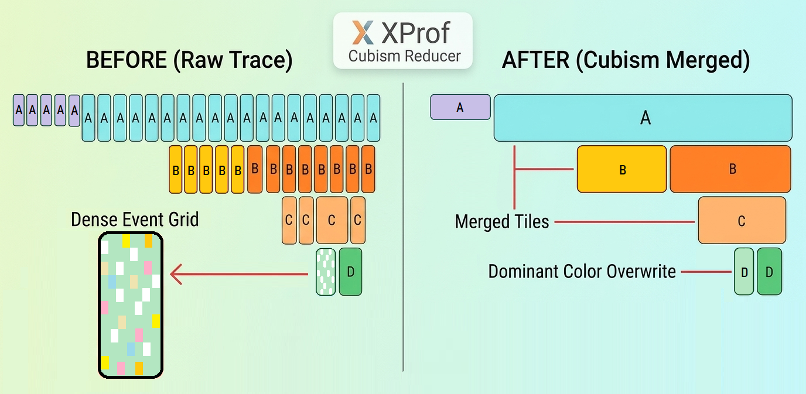
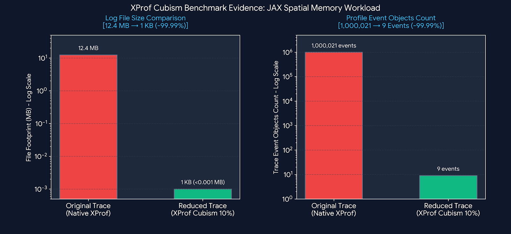

# XProf / TensorBoard Trace Log Reducer (v1.2.3)


[](https://huggingface.co/PastToFuture-Whisperer/xprof-cubism-reducer)
[](docs/ADVANCED_INTEGRATION_GUIDE.md)
[](https://ko-fi.com/pasttofuture_whisperer)

> **If your TensorBoard / XProf traces have become too large for routine browser inspection, this project targets that specific problem.**

It creates a lightweight, intentionally lossy overview of dense profiling traces (`.trace.json.gz`). The reduced output is intended for routine visual inspection; raw / high-resolution profiling data should be retained or collected separately when detailed analysis is required.

* **The primary goal is visualization scalability, not lossless trace preservation.**
* **It does not replace TensorBoard. It makes oversized TensorBoard / XProf traces easier to live with.**

> :book: **Looking for Extended Integration & Custom Recipes?**  
> Check out the **[Advanced Integration Guide (Actively Updated: 2026-08-19)](docs/ADVANCED_INTEGRATION_GUIDE.md)** for optional examples of concurrency locking, staging snapshots, shared storage handling, and pipeline recipes.

---

### Potential Operational Benefits

When deployed as part of an operational profiling pipeline, this utility may offer several workflow improvements:

* **Reduced Artifact Overhead:** Smaller routine profiling traces may reduce disk storage and transfer overhead across multi-node or cloud setups.
* **Lower Rendering Pressure:** Significantly lower event density may reduce browser-side rendering delay and memory pressure during routine dashboard inspection.
* **Practical Repeated Inspection:** Lightweight overview traces may make repeated TensorBoard / XProf inspection more practical in continuous integration.
* **Streamlined Debugging Friction:** Separating routine overview monitoring from detailed raw inspection may reduce overall operational friction during heavy training runs.
* **Potential Infrastructure Efficiency:** In sufficiently large workflows, reduced storage, bandwidth, and engineer waiting time may translate into broader infrastructure and engineering cost savings.

---

### Suggested Workflow: Coarse-to-Fine Observability Pattern

This tool is designed to support a multi-layered observability workflow rather than serving as an isolated, one-off script:

```text
Raw / high-resolution profiling data
        │
        ▼
Lightweight overview generation (tb_log_reducer.py)
        │
        ▼
Routine TensorBoard / XProf inspection (Overview Layer)
        │
        ▼
Suspicious time / thread region identified
        │
        ▼
Raw / high-resolution trace inspection for detailed analysis
```

*Note: `tb_log_reducer.py` is not an automated anomaly detector. Identifying "suspicious regions" remains an inspection step performed by engineers or external monitoring tools, supported by the lightweight overview.*

---

### Quick Start Guide

Zero third-party dependencies required—runs out of the box using pure standard Python 3.8+ and Bash:

#### Option A: Standalone Execution (Direct Python)
Process target log directories directly with Python standard libraries:

```bash
python3 tb_log_reducer.py --logdir ./tb_logs --resolution 50.0
```

#### Option B: Pipeline-Integrated Execution via Wrapper
Run target benchmarking or training scripts through `run_with_check.sh` for safe post-processing and automatic rollback protection:

```bash
# Usage: bash run_with_check.sh [Resolution %] [Target Script] [Arguments...]
bash run_with_check.sh 10 sample.py --logdir ./tb_logs
```

---

<a name="chapter-1"></a>
## 1. Technical Specifications & Structural Boundaries

`tb_log_reducer.py` restructures dense event arrays in TensorBoard trace logs (XProf format) using an algorithm designed for approximately linear time behavior under typical trace workloads.

### Core Processing Mechanisms



1. **Merged Tiles (Rectangular Consolidation):**
   Aggregates contiguous, identically named event streams within the same `(pid, tid)` lane into consolidated structural spans, significantly reducing trace event density and downstream rendering workload.

2. **Dominant Event Selection (Spatial Downsampling):**
   Bins duration events (`ph: "X"`) across time buckets per lane. Selects the dominant (longest duration) event per bucket while preserving exact UTF-8 byte length in masked names to reduce binary alignment risks.

### Failure Handling & Structural Safety Boundaries

* **Process-Isolated Backups:** `run_with_check.sh` creates `.bak.$$` backups tied to the process PID prior to processing, avoiding backup pollution during multi-trace sequential runs.
* **Structural Integrity Checks:** Performs post-processing checks verifying gzip readability, JSON parseability, and root data type compatibility using standard libraries.
* **Handled Rollback:** Automatically triggers best-effort rollback from backups if processing fails or structural corruption is detected.
* **Operational Scope Limits:** The wrapper handles expected execution failure paths and signal traps (`SIGINT`, `SIGTERM`). Uncatchable process terminations (`SIGKILL / kill -9`), physical filesystem failures, or power loss are outside its operational guarantees.

---

<a name="chapter-2"></a>
## 2. Documented Benchmark Results & Observed Metrics

The following metrics reflect empirical observations recorded on a documented benchmark workload under controlled testing:



#### Tested Workload Profile
* **Target Environment:** JAX / XLA Spatial Allocation Benchmark (`sample.py`)
* **Trace Log Payload:** `cs-default.trace.json.gz` (12.4 MB raw)
* **Configuration:** `--resolution 10.0`

```text
=== [UNIVERSAL PIPELINE] Running JAX Spatial Allocation Benchmark ===
  Executing Target Script : sample.py
  Target Logdir           : ./logdir_reduced
  Configured Resolution   : 10%
------------------------------------------------------------------
 [PROCESSING] Target Trace: ./logdir_reduced/plugins/profile/.../cs-default.trace.json.gz
 ├─ Original Total Events   : 1,000,021
 ├─ Original Duration Events: 1,000,000
 ├─ Reduced Duration Events : 9
 ├─ Final Output Events     : 30
 └─ Duration Event Reduction: 99.99%
 [MASKED] Processed binary metadata (Wire Type 2 Verified): cs-default.xplane.pb
 ├─ [INFO] Tile consolidation completed.

 [SUMMARY] Profile Reduction Metrics
 ├─ Current Resolution Configured: 10.00%
 ├─ Duration Event Reduction     : 99.99%
 └─ Estimated Resolution Floor   : 95.00%
```

### Observed Characteristics & Design Trade-offs

Observations indicate that the relative impact of Spatial Downsampling versus Rectangular Merging varies according to trace event characteristics:
* **Continuous Heavy Streams:** Rectangular merging contributes heavily by consolidating repetitive operation blocks.
* **High-Frequency Instant / Transient Spikes:** Spatial downsampling serves as an effective pre-processor, smoothing dense transient clusters across uniform time buckets.

Because spatial downsampling inherently involves a trade-off with event granularity, the resolution boundary remains fully user-configurable (`--resolution`) alongside an internal heuristic resolution floor (`ReducerConfig`).

---

### Feedback Wanted: Real-World Community Validation

As an open-source initiative, this project seeks real-world feedback to evaluate operational value across diverse ML development environments:

1. **Browser Responsiveness:** Did the reduced overview traces noticeably resolve browser freezes, rendering delay, or V8/WebGL memory pressure in your workflow?
2. **Workflow Utility:** Was the two-tier pattern (`Overview -> Suspicious Region -> Raw Trace`) practical for your daily profiling needs?
3. **Artifact Handling:** Did smaller overview traces reduce storage, transfer, or CI/CD pipeline friction in your team setup?
4. **Edge Cases:** Were critical short-duration events or structural patterns obscured by overview generation in specific model architectures?

If you have findings or edge cases to share, please consider opening an Issue or Discussion on GitHub.

---

### Advanced Integration Guide

For extended operational recipes and integration examples, please refer to the **[Advanced Integration Guide (Actively Updated: 2026-08-19)](docs/ADVANCED_INTEGRATION_GUIDE.md)**:

* **Concurrency Lock-Guards:** Multi-user directory locking via `flock` or POSIX atomic `mkdir`.
* **Active Process Guards:** Kernel handle inspection via `fuser` / `lsof` to avoid processing active writer directories.
* **Dynamic Resolution Scaling:** Pre-scanning trace file size to dynamically set heuristic resolution arguments.
* **Batch Storage Sync:** Recursive directory processing and cloud object storage (`AWS S3` / `GCS`) upload pipelines.

*Note: Integration recipes in the guide represent optional operational examples. Operators should evaluate retention, concurrency, and filesystem requirements for their specific environments.*

---

<a name="chapter-3"></a>
## 3. Research Context & Project Lineage

This repository emerged as a supporting utility during profiling research around **[xprof-jitter-interceptor](https://github.com/PastToFuture-Whisperer/xprof-jitter-interceptor)**. Dense TensorBoard / XProf traces increasingly became a practical obstacle to repeated inspection, which led to a simple experiment: reduce the trace sufficiently to preserve a clear macro-level overview, and return to raw profiling data only when detailed investigation is required.

The reducer remains intentionally narrow in scope. It is not a replacement for raw profiling data, a live debugger, or an automated anomaly detector. Its purpose is to make oversized traces easier to inspect as lightweight visualization artifacts.

The project also explores a broader operational idea: profiling does not always need to begin with the highest-resolution artifact. A lightweight overview may serve as the first inspection layer, with raw traces reserved for regions requiring deeper analysis. Whether this workflow reduces profiling friction, infrastructure overhead, or engineering time at scale remains an open question that real-world deployment can help evaluate.

Low-level systems research continues through projects such as `xprof-jitter-interceptor`, while broader AI control architectures are explored via `perceptual-chain`.

---

### Support & Sponsorship

If you find `xprof-cubism-reducer` (or `perceptual-chain`) useful in your workflow, consider supporting ongoing development and research through Ko-fi:

[]([https://ko-fi.com/pasttofuture_whisperer](https://ko-fi.com/pasttofuture_whisperer))

Your contributions support continuous benchmark testing, open-source maintenance, and theoretical research in AI control architecture.

---

### License & Enterprise Compliance

* **License:** Original software implementation published under the [MIT License](LICENSE).
* **Zero Dependencies:** Operates strictly using standard Python 3.8+ libraries and standard Bash environments, passing standard corporate supply-chain and legal audits.
* **Proprietary IP Distinction:** Core jitter control, micro-timer interception models, and hardware-level variance suppression architectures discussed in related research belong to separate IP repositories (`xprof-jitter-interceptor`) and are explicitly excluded from this repository.

> **Don't be evil, ¯\\\_(ツ  )\_/¯ but ¯\\\_(  ツ)\_/¯ don't be serious...!**
